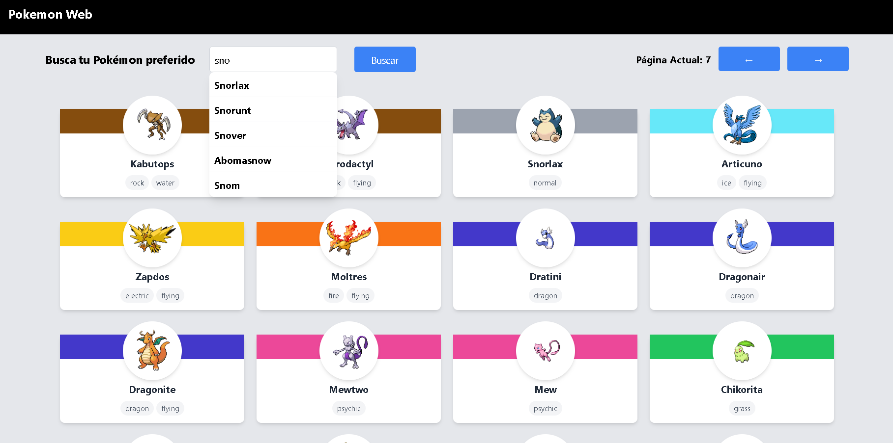
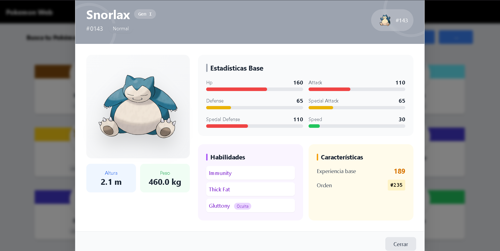

<div align="center">

# Poke Web

### Consulta información sobre tu pokemon favorito en la poke web

</div>

---

## 📝 Descripción del proyecto

Aplicación enfocada a presentar a los usuarios información sobre Pokemones. Cuenta con funciones de **autocompletado**, **fetch a la api de poke api** y **renderizado dinámico** etc.

---

## 📸 Capturas de pantalla

|              Vista principal              |              Otra vista              |
| :---------------------------------------: | :----------------------------------: |
|  |  |

---

## 🚀 Instalación y ejecución

### 1. Clona el repositorio

```bash
git clone https://github.com/kacto1973/poke-api
```

### 2. Instala la extensión de VSCode

> **Live Server** — _Ritwick Dey_
>
> Búscala directamente en el panel de extensiones de VSCode (`Ctrl+Shift+X`).

### 3. Ejecuta la aplicación

1. Haz **click derecho** sobre el archivo `index.html`
2. Selecciona **"Open with Live Server"**

¡Listo! La aplicación se abrirá automáticamente en tu navegador. 🎉

---

## 🌐 Demo en vivo

**👉 [poke-web-api-program.netlify.app](https://poke-web-api-program.netlify.app/)**
